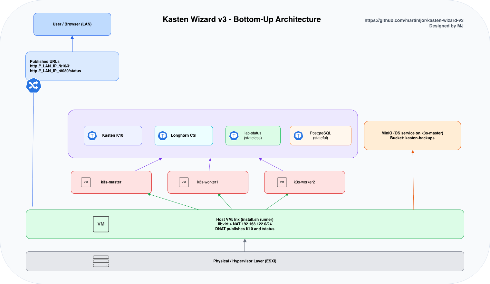

# kasten-wizard-v3

Automated lab deployment for **Kasten K10** on a nested K3s environment.

This project is designed for demo/lab usage where you want a reproducible setup with:
- K3s cluster (master + 2 workers)
- Longhorn CSI
- Kasten K10
- MinIO (running as an OS service on k3s-master)
- Optional Kasten Location Profile auto-configuration
- Stateless `lab-status` app exposed on port `8080`
- Optional stateful PostgreSQL demo with sample data and check script

---

## Architecture



- Editable source: `Arch.drawio`
- Interactive HTML: `Arch.drawio.html`
---

## 1) What this project does

`install.sh` provisions and validates a full lab workflow end-to-end, including post-install UX output with URLs and run-specific logs.

It is optimized for:
- repeatable demos
- quick reset via VM snapshot restore
- low-friction validation of Kasten features

---

## 2) Requirements

- Ubuntu host VM (recommended)
- Nested virtualization enabled (VMX/SVM passthrough)
- `sudo` access
- Internet access for package/image downloads
- Recommended resources on lab host VM:
  - 8 vCPU
  - 24 GB RAM

Check virtualization support:

```bash
egrep -c '(vmx|svm)' /proc/cpuinfo
```

> Officially tested on Linux/x86_64 lab flow. ARM/Mac is best-effort.

---

## 3) Quick start

```bash
git clone https://github.com/martinljor/kasten-wizard-v3.git
cd kasten-wizard-v3
chmod -R +x .
sudo ./install.sh
```

During execution, you may be prompted for optional steps (strict `yes/no` validation), for example:
- Kasten Location Profile auto-bootstrap
- Stateful PostgreSQL demo deployment

---

## 4) How to run (recommended flow)

1. Restore your host VM snapshot (clean lab baseline).
2. Clone/pull latest repository.
3. Run:
   ```bash
   sudo ./install.sh
   ```
4. Wait for completion panel with URLs.

---

## 5) What each step does

- **Step 1**: Environment validation
- **Step 2**: System preparation
- **Step 3**: Required tooling install
- **Step 4**: Create nested K3s VMs
- **Step 5**: Install K3s cluster
- **Step 6**: Cluster health checks
- **Step 7**: Install Longhorn
- **Step 8**: Install Kasten K10 + ingress exposure
- **Step 9**: Install MinIO on k3s-master OS + create bucket
- **Step 10**: (Optional) Auto-configure Kasten Location Profile
- **Step 11**: Deploy stateless `lab-status` service on `:8080/status`
- **Step 12**: (Optional) Deploy stateful PostgreSQL demo + seed data + host check script

---

## 6) Outputs and access

Typical outputs after success:
- K10 internal URL
- K10 LAN URL
- MinIO endpoint and bucket
- Stateless app URL (`/status`)
- Optional PostgreSQL stateful details + generated check script path

Common access examples:
- `http://<host-lan-ip>/k10/#`
- `http://<host-lan-ip>:8080/status`

---

## 7) Logs and run IDs

Each execution has a unique `RUN_ID`.

Per-run logs are written as:
- `kubernetes-lab-installer-<RUN_ID>.log`
- `steps-status-<RUN_ID>.log`
- `access-summary-<RUN_ID>.log`
- `fail-summary-<RUN_ID>.log`

Latest symlinks are also maintained:
- `/var/log/k10-mj/kubernetes-lab-installer.log`
- `/var/log/k10-mj/steps-status.log`
- `/var/log/k10-mj/access-summary.log`
- `/var/log/k10-mj/fail-summary.log`

---

## 8) Troubleshooting

- If K10 URL works internally but not from LAN, check host firewall/NAT rules.
- If nested VMs fail on ARM/Mac, validate virt/cpu model compatibility in step 4.
- If an execution fails, inspect:
  ```bash
  /var/log/k10-mj/fail-summary.log
  ```

---

## 9) Repository layout

```text
install.sh
ui.sh
steps/
ansible/
README.md
```

## 10) Project history

This project is part of an ongoing development effort.

Legacy repository:
- https://github.com/martinljor/kasten-wizard-v2
